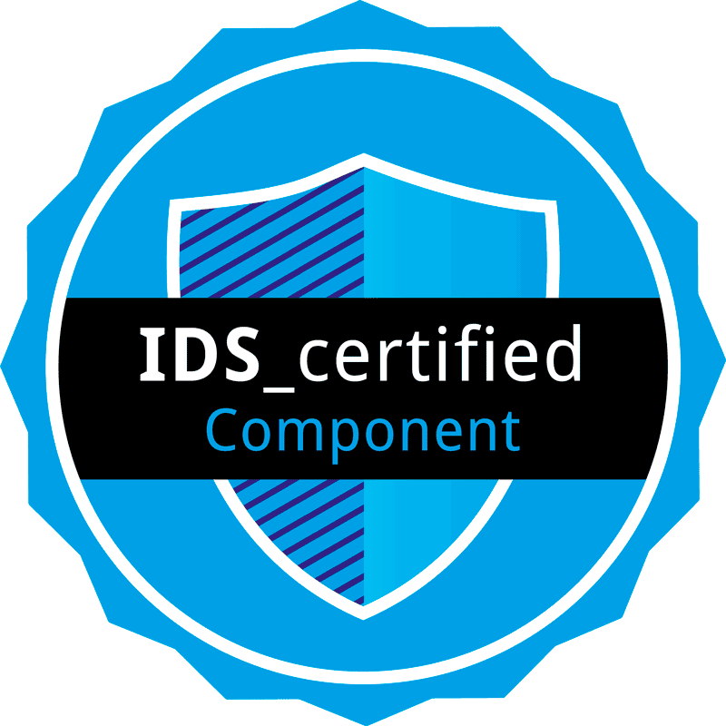

# OneNet DSP Connector (v2)

## Introduction



This project started from and extends the [Engineering DSP True Connector](https://github.com/Engineering-Research-and-Development/dsp-true-connector), a general purpose Data Space Connector and open-source project developed by ENG, supporting IDSA Data Space Protocol standard (current version 2024-1). The connector is an open-source solution, designed to enable self-determined data sharing while ensuring compliance with regulations such as GDPR. Initially focused on the manufacturing domain, the TRUE Connector has proven its versatility across diverse sectors including circular economy, energy, smart buildings, and agri-food domains. It has received IDS certification.

<br />


Furthermore, the project builds upon the work carried out with the [OneNet connector](https://github.com/european-dynamics-rnd/OneNet), developed within the [OneNet project](https://www.onenet-project.eu/) and extended in [Interstore Project](https://interstore-project.eu/). Specifically, the following elements were adopted and extended from the OneNet connector: 

* the OneNet Middleware for centralized services such as Identity Management and Service Catalogue (extended)
* the Semantic Vocabulary with more than 60 standardized services for the energy domain
* New open-source advanced GUI
* Integration of External Service via REST APIs and Push mechanisms

## New Features 

Starting from version 2, the OneNet DSP Connector includes support for the IDSA Data Space Protocol (current version: 2024-1).

## Prerequisites
The deployment process involves the use of Docker containers. The use of Docker guarantees not only an easy deployment process and total portability of the solution, but also a high level of scalability of the released applications.
The hardware and operating system prerequisites are:
* A 64bit 2-core processor
*	8GB RAM Memory
*	50GB of disk space or more

The software prerequisites include:
*	Linux or Windows (preferably Server edition) Operative System (OS);
*	docker and docker-compose;

OneNet Connector software and its components are available via the Docker containers. Firstly, the Docker platform has to be downloaded and installed accordingly to the OS of the server to host the deployment.
For the correct installation of docker and docker-compose, please refer to the official guides: https://docs.docker.com/get-docker/

## OneNet DSP Connector v2 installation on Docker
To proceed with the installation of OneNet Connector, the user must use the docker folder of the github repository that contains all the necessary configuration.

1.	The first step is to clone this repository https://github.com/TwinEU-Digital-Twin-for-Europe/data-space-connector in a specific folder (e.g. *onenet-framework*), by typing:
```
mkdir onenet-framework
cd onenet-framework
git clone https://github.com/TwinEU-Digital-Twin-for-Europe/onenet-dsp-connector.git
```

2.	There is the *docker-compose.yml* file located under the docker folder that contains all the configuration of the OneNet DSP Connector containers. Go to that folder by typing the command:
```
cd onenet-dsp-connector/docker
```

3.	Start the containers with the below command:
```
docker compose up -d
```
The default configuration, recommended for connector testing, simulates a complete environment with 2 connectors within the same docker.
If, however, you want to use the connector in a real environment, or test it with 2 independent machines, please read section [Deploy a single connector instance](#deploy-a-single-connector-instance).

4.	To show logs use the command:
```
docker compose logs -f
```
Alternatively you can use dozzle UI to access the logs of each container. Open the following url on your browser :
```
http://localhost:8085
```

5.	If no errors are seen, this means that OneNet DSP Connector was successfully deployed on your premisses.

To stop all the containers use:
```
docker compose down
```

### Hints

#### Deploy a single connector instance
The configuration present within the docker-compose.yml simulates a complete environment with 2 connectors.
By starting this configuration both connectors are started within the same docker.

If, however, you want to use the connector in a real environment, or test it with 2 independent machines, you can deploy a single connector instance.
For this purpose, an additional docker-compose file (*docker-compose-single.yml*) is provided that launches a single connector instance.
You can start this configuration using the commands:
```
docker compose -f docker-compose-single.yml up -d
```
and stop with:
```
docker compose -f docker-compose-single.yml down
```
This configuration is recommended for installing a connector production node because it allows you to launch a single connector instance and save hardware resources.

#### Optional proxy configuration (using nginx)
Optionally you can use nginx as proxy.

The following example defines the nginx service to start (from the official image), the exposed ports and the volumes to mount.

```
services:
  nginx:
   image : nginx:latest
   ports :
       - "8081:8081"
       - "80:80"
       - "443:443"
   volumes:
       - ./ssl:/etc/nginx/ssl
       - ./nginx.conf:/etc/nginx/conf.d/default.conf
``` 

The [(_nginx.conf_)]contains header management, SSL configuration and location directives necessary for the correct functioning of the connector.

In particular, for each service to be exposed, a location type directive must be defined with the following configurations (please replace the _**path**_ and _**uri**_ placeholders with your own values):
```
  location /<path> {
    proxy_pass <uri>;
    proxy_redirect off;
    proxy_set_header    Upgrade     $http_upgrade;
    proxy_set_header    Connection  "upgrade";
    proxy_set_header Host $host:$server_port;
    proxy_set_header X-Forwarded-For $proxy_add_x_forwarded_for;
    proxy_set_header X-Forwarded-Ssl on;
    proxy_set_header  X-Forwarded-Proto  https;
    rewrite ^/<path>/(.*)$ /$1 break;
  }
``` 

For further information, refer to the [Official Nginx Guide](https://nginx.org/en/docs/).

### Login & Connector Settings
A Graphical User Interface is available together with OneNet Connector. It can be accessed through the url:
```
http://localhost:8081/
```

1.	You should see the login interface, sign-in using the username & password that you received from the TwinEU Data Space Framework administrators.

2.	Navigate to the connector settings by the sidebar menu & define the urls of your Onenet DSP Api Url and Connector Url. Those 2 connector applications are running on the containers that you installed, so the urls must be configured accordingly as shown below.

#### Local Api Url
The url must be http://your_ip_where_the_containers_are_installed:30001/api
In the default testing configuration two local-api are exposed to the URLs http://localhost:30001/api or  http://localhost:30002/api, one for connector a and one for connector b.

#### Data App Url
In the default testing configuration the connectors are exposed to the URLs http://connector-a:8080 or  http://connector-b:8080.


### Environment Configuration

Inside the */docker* project folder, there is an *.env* environment configuration file. This file allows you to set all Back End configurations of the Onenet DSP Connector. 

#### Push Mechanism Flow
The Push mechanism flow is enabled by default. To disable the function use the env variable below.
```
PUSH_ENABLED = **true|false**
```
The Push URI can be configured in Push service creation interface.